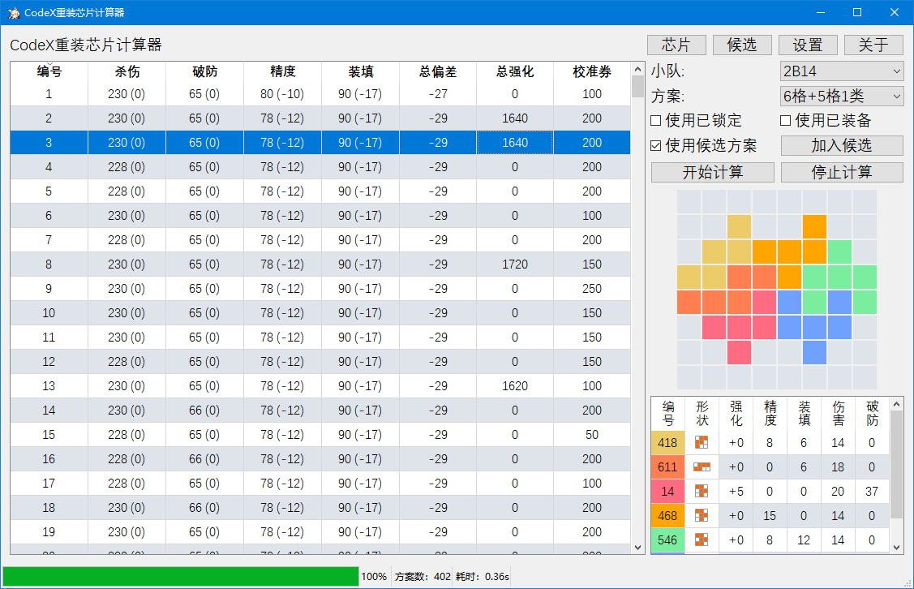

# CodeX重装芯片计算器  
该项目已开源，链接：[CodeX](https://github.com/xxzl0130/CodeX).  
[程序说明书](https://github.com/xxzl0130/CodeX/blob/master/doc/%E4%BD%BF%E7%94%A8%E8%AF%B4%E6%98%8E.md)  
[视频教程](https://www.bilibili.com/video/BV1r7411N75u/)  

## 简介  
本项目是游戏少前的开源工具，主要用于计算游戏内的重装芯片的拼图方案。  
### 芯片问题简介  
芯片为从2格到6格不等的4联通块，每个格子会被随机赋予4种属性其一，即一个n格的芯片只能有合计n点的4项属性。  
每个重装会有一定形状的空白区域供芯片铺放，不能超出格子，可以留空。  
每个重装的4项属性有一个最优配置，目标是打到那个配置。  
总结来说，是要在完美覆盖问题下求解最优方案。  

## 项目需求  
* 配合[代理工具](GirlsFrontlineProxy.md)读取用户芯片数据  
* 在GUI界面展示芯片数据  
* 在实现完美拼图的基础上求解最优属性方案  
* 在GUI展示方案信息  

## 主要技术
* Qt5  
* DLX算法  
* 深度优先搜索与剪枝  
* GUI设计  

## 开发平台
Windows，VS 2019，Qt 5，理论上可跨平台  
  
