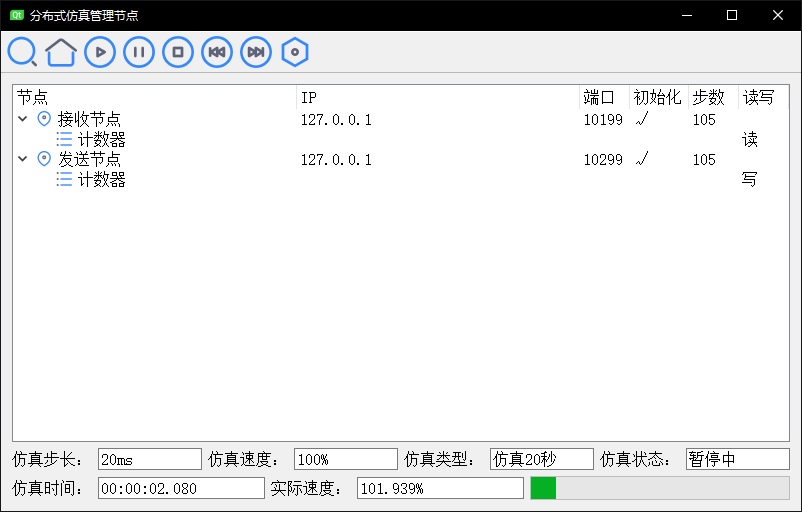

# 分布式仿真系统
本项目为实验室研究项目基础。  

## 项目需求
* 通过网络通信连接多个节点，每个节点可能读或写不同的数据包  
* 管理节点负责记录各节点信息，通知节点推进仿真  
* 保证仿真每一步计算完成之后才进行下一步  
* 仿真速度可调，默认为实时仿真  
* 仿真节点可部署在同一台或多台计算机上  

## 主要技术与实现方案
* Win Socket API编程，实现UDP组播  
* 自定义通讯帧格式  
* 通过多媒体定时器实现高精度定时器  
* 管理节点记录仿真信息，负责发送推进指令  
* 仿真节点之间形成星型连接，相互广播数据  
* 另外使用Qt搭建了管理节点界面程序  

## 开发平台  
Windows，VS 2017+，Qt 5
