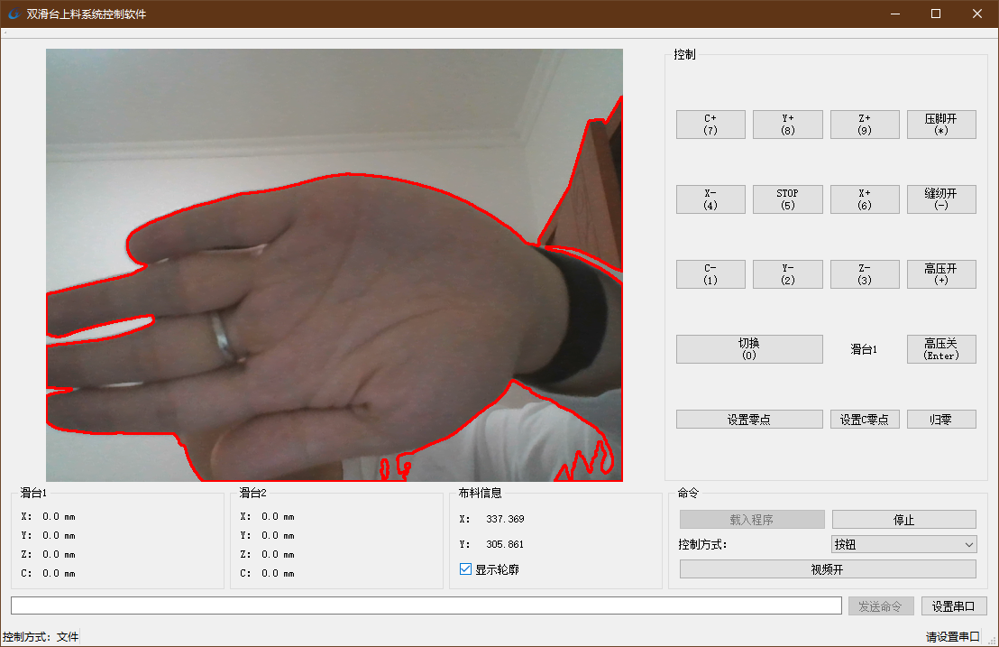

# 布料上料系统
版权归属：[吸力奇迹（北京）有限公司](http://www.xiliqiji.com/)  
[程序文件](../binary/FeedingSystem)  
[部分源代码](../source/FeedingSystem)  

## 项目需求
* 通过单目摄像头对布料位置定位
* 控制以Arduino为下位机的上料控制系统
* 提供GUI界面操作上料控制
* 提供编程控制上料步骤接口
* 开发基于Arduino和步进电机的上料控制系统

## 主要技术
* Qt
* OpenCV-实现目标检测定位，物理位置解算
* 多线程
* Arduino
* 步进电机

## 开发平台
Windows，VS 2019，Qt 5, Ardunio for VS  
