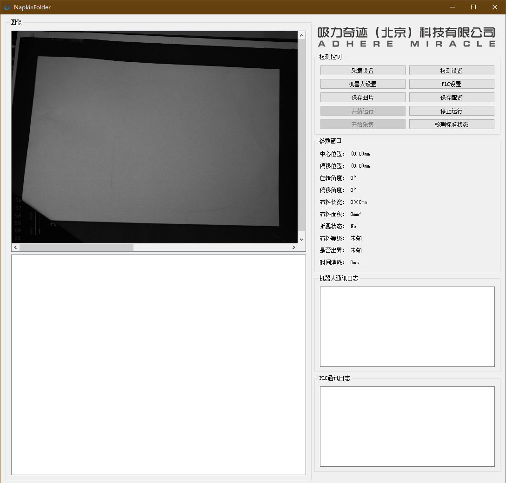

# NapkinFolder
餐巾折叠机上位机程序  
版权归属：[吸力奇迹（北京）有限公司](http://www.xiliqiji.com/)  
[程序文件](../binary/NapkinFolder)  
[部分源代码](../source/NapkinFolder)   

## 项目需求
* 通过单目摄像头对已知规格的餐巾进行位置、角度、尺寸的求解。  
* 与PLC通信，接受PLC控制。  
* 与机器人通信，将餐巾位姿偏差信息发送至机器人以供其对准餐巾。  
* 适当的GUI界面以供调试使用，可将各项配置保存，可使程序无人值守自动运行。  

详细说明可见[这里](../source/NapkinFolder/README.md)。

## 主要技术
* Qt
* OpenCV图像处理
* 多线程
* 串口通信
* TCP通信

## 运行环境
工控机，Windows 10.  
开发依赖VS 2017+，Qt 5.0。  
运行截图：  
