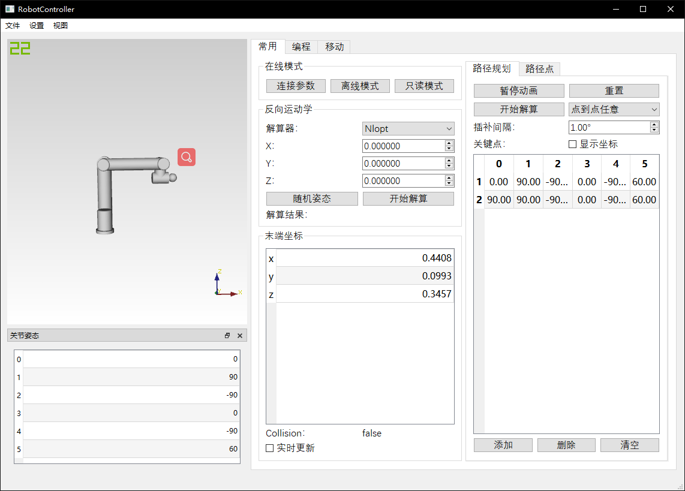

# 机器人上位机控制器
版权归属：[德国帝尔电子（北京）有限公司](http://www.trelectronik.com/)  
[程序文件](../binary/RobotController/)  
[部分源代码](../source/RobotController/)  

## 项目需求  
* 载入机械臂模型，构建可视化动态预览  
* 给定末端位姿，反解六轴姿态  
* 碰撞检测  
* 轨迹规划与曲线插补  
* 简单的运动编程  
* 美观大方的GUI界面  

## 主要技术与实现方案  
* 主要在[Robotics Library](https://www.roboticslibrary.org/)的基础上开发机器人控制相关内容  
* 自主编写S型曲线插补算法  
* 自定义机械臂编程系统，从指令基类开始构建多态  
* Qt编写界面  
* 多线程编程，主要用于姿态解算器  

## 开发平台  
Windows，VS 2017+，Qt 5
